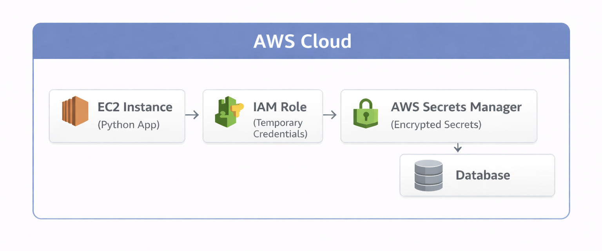
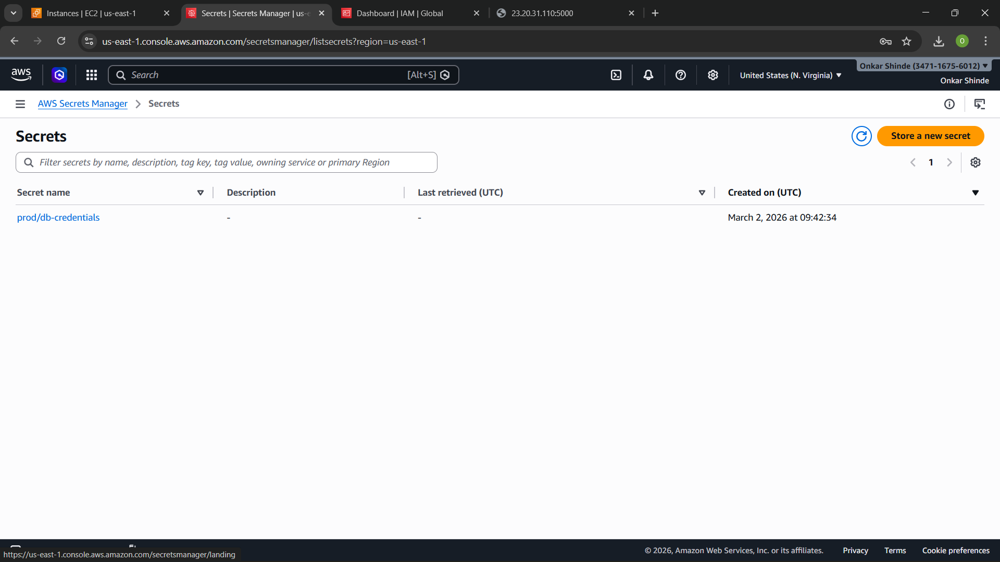
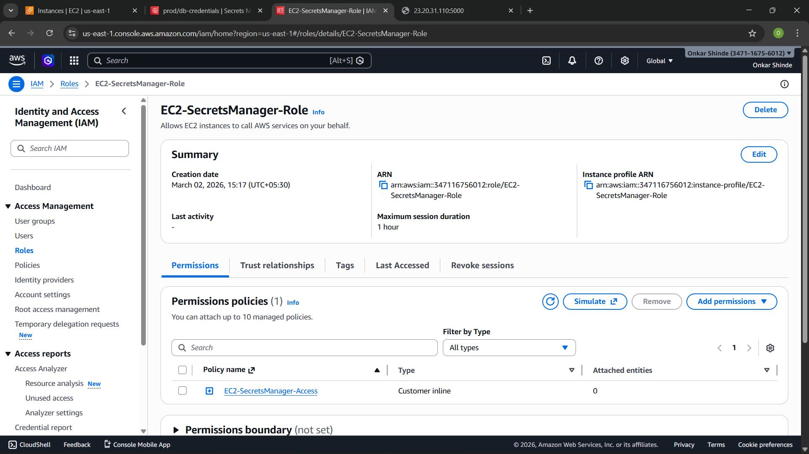
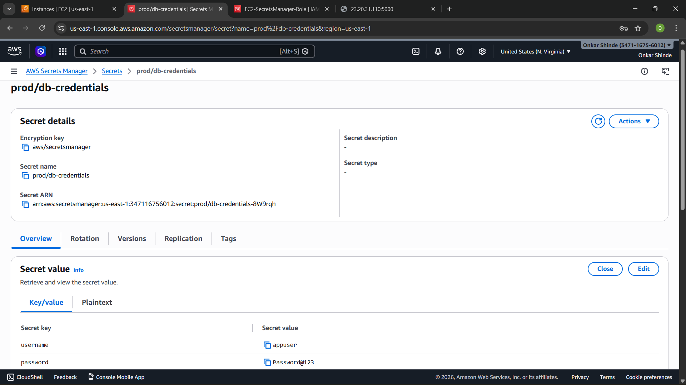

# 🔐 Centralized Secret Management System using AWS Secrets Manager & IAM

---

## 📌 Project Overview

This project demonstrates how to securely manage sensitive credentials using AWS by eliminating hardcoded secrets from application code and implementing centralized secret storage.

It follows a **DevSecOps approach** by integrating security directly into application design.

---

### 🏗️ Architecture Diagram



---

## 🎯 Objectives

* Remove hardcoded credentials from application code
* Store secrets securely using AWS Secrets Manager
* Control access using IAM roles (no access keys)
* Enable dynamic secret retrieval at runtime
* Follow security best practices (DevSecOps)

---

## ⚙️ Technologies Used

* AWS EC2
* AWS Secrets Manager
* AWS IAM
* Python (boto3 SDK)

---

## 🚀 Implementation Details

### 🔴 1. Insecure Approach (Before)

📂 File: `app/app_insecure.py`

* Credentials stored directly in code

❌ Example:

```python
user = "appuser"
password = "password@123"
```

### Issues:

* Exposed credentials
* High security risk
* Not scalable

---

### 🟢 2. Secure Approach (After)

📂 File: `app/app_secure.py`

* Credentials fetched dynamically from AWS Secrets Manager

✅ Key Features:

* No hardcoded secrets
* Secure API call to AWS
* Runtime credential retrieval

---

## 🔄 How It Works (Flow)

1. Application runs on EC2
2. EC2 is attached with IAM Role
3. IAM Role provides temporary credentials
4. Application calls AWS Secrets Manager
5. Secrets are retrieved securely
6. Application uses credentials

---

## 🔐 IAM Role & Policy

📂 File: `iam-policy/iam-policy.json`

* Permission granted:

  * `secretsmanager:GetSecretValue`

✅ Principle Applied:

* Least Privilege Access

---

## 🔒 Secrets Manager Configuration

* Stored:

  * Database Username
  * Database Password

* Encryption:

  * AWS-managed KMS key

---

## 🔄 Secret Rotation

AWS Secrets Manager supports automatic rotation.

### Why It Matters:

* Reduces risk of credential leaks
* Limits exposure time
* Improves compliance
* Enhances security posture

---

## 🔐 Security Improvements

| Before                | After                  |
| --------------------- | ---------------------- |
| Hardcoded credentials | No credentials in code |
| Plaintext secrets     | Encrypted storage      |
| Static credentials    | Dynamic retrieval      |
| Access keys used      | IAM role-based access  |

---

## 📸 Screenshots

### 🔹 Secret Created in AWS Secrets Manager



### 🔹 IAM Role Attached to EC2



### 🔹 Application Fetching Secret



---

## 📂 Project Structure

```
aws-centralized-secret-management/
│
├── app/
│   ├── app_insecure.py
│   ├── app_secure.py
│   └── requirements.txt
│
├── iam-policy/
│   └── iam-policy.json
│
├── screenshots/
│   ├── secret-created.png
│   ├── iam-role.png
│   └── secret-retrieval.png
│
└── README.md
```

---

## 🧪 Validation Performed

* Application runs without hardcoded credentials
* Secrets successfully retrieved from AWS
* No access keys configured on EC2
* IAM role used for authentication

---

## ⚠️ Best Practices Followed

* Never store secrets in code
* Use IAM roles instead of access keys
* Apply least privilege access
* Enable secret rotation
* Encrypt sensitive data

---

## ⭐ Future Improvements

* Enable automatic secret rotation using Lambda
* Integrate with real database
* Add monitoring using CloudWatch
* Use Infrastructure as Code (Terraform)

---

## 👨‍💻 Author

**Onkar Shinde**
Cloud & DevOps Enthusiast

---
